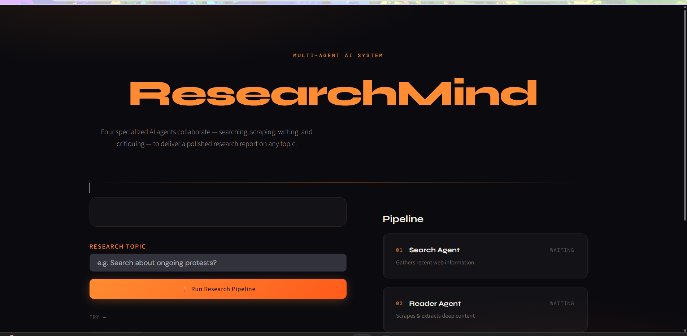

# 🚀 AetherAI – Autonomous Multi-Agent Research Engine
## 📷 Application Preview



ResearchMind is a multi-agent AI research system that automates the complete research workflow using specialized AI agents. The application performs web search, extracts relevant information from trusted sources, generates a structured research report, and evaluates the report quality through an AI critic.

Built using **LangChain**, **LCEL (Runnable Pipelines)**, **Mistral AI**, **Tavily Search**, **BeautifulSoup**, and **Streamlit**.

---

## ✨ Features

- 🌐 AI-powered web research using Tavily Search
- 📄 Intelligent web scraping using BeautifulSoup
- 🤖 Multiple specialized AI agents
- ✍️ Automated research report generation
- 🧐 AI-based quality review and feedback
- ⚡ LCEL Runnable pipelines (No LLMChain)
- 🎨 Interactive Streamlit interface
- 📥 Export generated reports in Markdown format

---

## 🏗️ Architecture

```
                    User Query
                         │
                         ▼
               🔍 Search Agent
               (Tavily Search)
                         │
                         ▼
              📄 Reader Agent
          (BeautifulSoup Scraper)
                         │
                         ▼
            ✍️ Writer Runnable Chain
                         │
                         ▼
            🧐 Critic Runnable Chain
                         │
                         ▼
              Final Research Report
```

---

## 🧠 Agents

### 🔍 Search Agent
- Searches the web using Tavily
- Collects reliable and recent information
- Returns relevant search results

### 📄 Reader Agent
- Extracts the most relevant URL
- Scrapes webpage content using BeautifulSoup
- Provides detailed information

### ✍️ Writer Chain
- Combines search and scraped information
- Produces a structured research report
- Includes:
  - Introduction
  - Key Findings
  - Conclusion
  - Sources

### 🧐 Critic Chain
- Reviews the generated report
- Assigns a quality score
- Highlights strengths
- Suggests improvements

---

## 🛠 Tech Stack

| Category | Technologies |
|----------|--------------|
| LLM | Mistral AI |
| Framework | LangChain |
| Pipeline | LCEL (Runnable Pipeline) |
| Search | Tavily Search |
| Web Scraping | BeautifulSoup |
| UI | Streamlit |
| Environment | Python |
| Prompting | ChatPromptTemplate |

---

## 📂 Project Structure

```
AetherAI/
│
├── app.py                # Streamlit Application
├── agents.py             # Search, Reader, Writer & Critic Agents
├── tools.py              # Tavily & Web Scraping Tools
├── pipeline.py           # Multi-Agent Research Pipeline
├── requirements.txt
├── .env
└── README.md
```

---

## ⚙️ Installation

### Clone Repository

```bash
git clone https://github.com/your-username/AetherAI.git
cd AetherAI
```

### Install Dependencies

```bash
pip install -r requirements.txt
```

### Create Environment File

Create a `.env` file:

```env
MISTRAL_API_KEY=your_mistral_api_key
TAVILY_API_KEY=your_tavily_api_key
```

---

## ▶️ Run Application

```bash
streamlit run app.py
```

---

## 📸 Workflow

```
User Input
     │
     ▼
Search Agent
     │
     ▼
Reader Agent
     │
     ▼
Writer Chain
     │
     ▼
Critic Chain
     │
     ▼
Final Report
```

---

## 📈 Example Output

The application generates:

- Detailed research report
- Structured findings
- Reliable sources
- AI-generated quality assessment

---

## 🔮 Future Improvements

- PDF Export
- Citation Generation
- Multi-source comparison
- Research history
- Streaming responses
- Additional research agents
- Support for multiple LLM providers

---

## 👨‍💻 Author

**Rohan Baviskar**

If you found this project useful, consider giving it a ⭐ on GitHub.